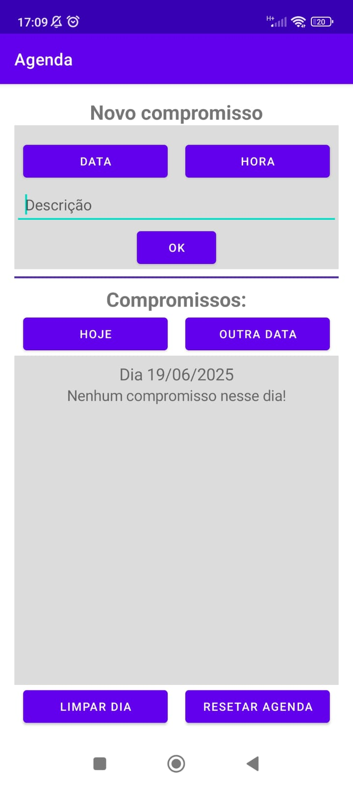
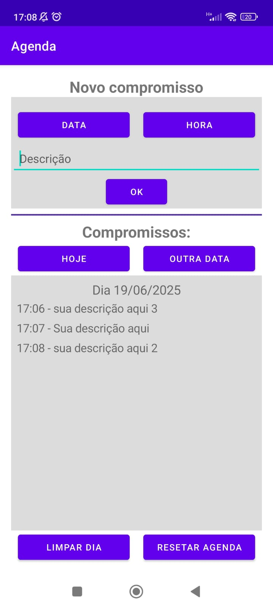
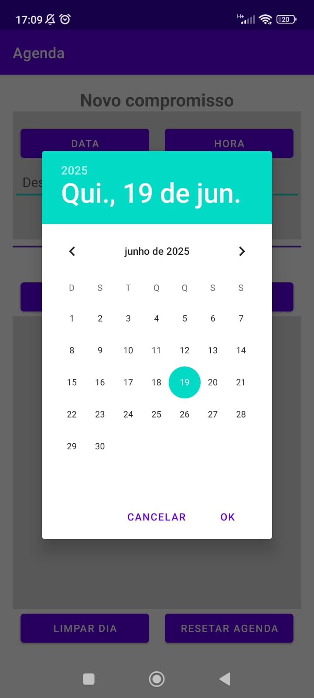
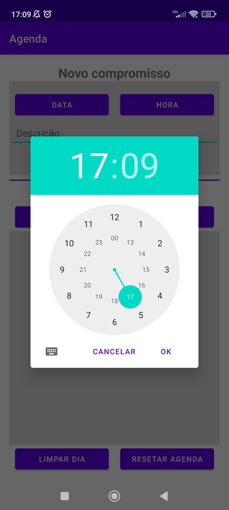

# App de Filmes (Android - Java)

Aplicativo de agenda desenvolvido em **Java** para Android, utilizando o padrão **MVC**, utilizando o Busca em **API REST**, e persistência de dados local com **SQLite** via **Room**.

---

## Tecnologias Utilizadas

- **Java (Android SDK)**
- **API de filmes da Netflix**
- **Room (SQLite)**
- **Arquitetura MVC**

---

## Funcionalidades

- Listagem dos filmes disponíveis no catalogo da Netflix via API
- Paginação dos filmes com botões ANTERIOR e PROXIMA
- Seleção de multiplos filmes para adicionar na lista
- Lista dos filmes salvos organizados por nota do IMDB obtido pela mesma API de forma decrescente
- Armazenamento local com banco de dados SQLite  
- Pesquisa por nome para adicionar o filme na lista 

---

## Capturas de Tela
### Tela inicial sem compromissos registrados

### Tela inicial com compromissos

### Fragment para selecionar a Data ao clicar no botao DATA (registra) e no OUTRA DATA (pesquisa)

### Fragment para selecionar o Horário ao clicar no botao HORA

Obs: As datas e horário padrão ao abrir os fragments serão o dia e horario atual, e a listagem padrão ao abrir o app também será o dia atual.

---

## Autores

- **Henrique Luiz de Almeida Lopes**  
  [LinkedIn](https://www.linkedin.com/in/henrique-luiz-almeida-lopes) | [GitHub](https://github.com/HenriqueLopes-dev)
- **Caio Henrique Carvalho de Paiva**  
  [LinkedIn](https://www.linkedin.com/in/caio-henrique-carvalho-de-paiva) | [GitHub](https://github.com/Caiopaiva07)
- **Alexsandro Bueno**  
  [LinkedIn](https://www.linkedin.com/in/alexbueno-dev) | [GitHub](https://github.com/alexbueno-dev)

---

## 📄 Licença

Este projeto está licenciado sob a licença MIT. Consulte o arquivo [LICENSE](LICENSE) para mais detalhes.
